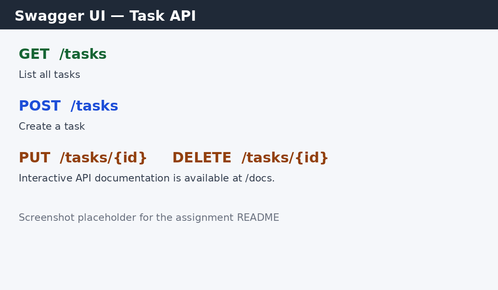

# Task API

A beginner-friendly CRUD API built for the FlyRank Backend Internship Week 2 assignment. It manages an in-memory list of tasks with Express.js. Data is intentionally reset whenever the server restarts; no database is used.

## Requirements

* Node.js 18 or newer
* npm

## Installation

```bash
npm install
```

## Run

```bash
npm start
```

The hand-built API runs at `http://localhost:3000`.

## Endpoints

|Method|Endpoint|Description|Success|Errors|
|-|-|-|-|-|
|GET|`/`|API information|200|—|
|GET|`/health`|Health check|200|—|
|GET|`/tasks`|List all tasks|200|—|
|GET|`/tasks/:id`|Get one task|200|404|
|POST|`/tasks`|Create a task|201|400|
|PUT|`/tasks/:id`|Update a task title and/or completion status|200|400, 404|
|DELETE|`/tasks/:id`|Delete a task|204|404|
|GET|`/stats`|Return total, done, and open counts|200|—|
|POST|`/reset`|Restore the three sample tasks|200|—|
|GET|`/docs`|Interactive Swagger UI documentation|200|—|

## Optional query parameters

* `GET /tasks?done=true` returns only completed tasks. Use `done=false` for open tasks.
* `GET /tasks?search=milk` searches task titles case-insensitively.
* `GET /tasks?limit=2\&offset=2` returns a page of matching tasks.
* Filtering, search, and pagination can be combined.

## Example curl requests

List tasks:

```bash
curl -i http://localhost:3000/tasks
```

Create a task:

```bash
curl -i -X POST http://localhost:3000/tasks \\
  -H "Content-Type: application/json" \\
  -d '{"title":"Buy milk"}'
```

Example response:

```text
HTTP/1.1 201 Created
Content-Type: application/json; charset=utf-8

{"id":4,"title":"Buy milk","done":false}
```

Filter, search, and paginate:

```bash
curl -i "http://localhost:3000/tasks?done=false\&search=express\&limit=2\&offset=0"
```

Get statistics and reset the in-memory data:

```bash
curl -i http://localhost:3000/stats
curl -i -X POST http://localhost:3000/reset
```

Update a task:

```bash
curl -i -X PUT http://localhost:3000/tasks/4 \\
  -H "Content-Type: application/json" \\
  -d '{"done":true}'
```

Delete a task:

```bash
curl -i -X DELETE http://localhost:3000/tasks/4
```

## Swagger UI

Open [http://localhost:3000/docs](http://localhost:3000/docs) while the server is running. Use **Try it out** to complete the full CRUD cycle and try the optional endpoints without curl.

The OpenAPI document is generated from the route comments with `swagger-jsdoc` when the server starts and is served through `swagger-ui-express`. The generated document is also saved as `openapi.json`.



## Mortality experiment

The tasks are stored only in memory, so creating a task and restarting the server removes that task. This happens because there is no database or file persistence yet; the assignment uses this limitation to prepare for database work in Week 3.

## AI vs me

### Prompt used

> Build a beginner-friendly JavaScript Node.js API using Express.js only. Use port 3001 and an in-memory array with three sample tasks containing numeric id, string title, and boolean done fields. Implement GET /, GET /health, GET /tasks, GET /tasks/:id, POST /tasks, PUT /tasks/:id, and DELETE /tasks/:id. POST must require a non-empty title, assign the next id, set done to false, and return 201. PUT must allow title and/or done updates, reject an empty or invalid body with 400, and return 404 for an unknown id. DELETE must return 204 with no body and 404 for an unknown id. Return JSON errors and keep the code beginner-friendly with no database, authentication, TypeScript, ORM, or unnecessary folders. Also include Swagger UI at /docs using swagger-ui-express and document the API with an OpenAPI file.

### Three concrete differences found

1. The AI version combines the POST title validation messages, while the hand-built version distinguishes “Title is required” from “Title cannot be empty.”
2. The AI version uses a separate port, 3001, so it can be run beside the hand-built API for comparison.
3. The hand-built version includes the optional filtering, search, statistics, reset, pagination, and Swagger-jsdoc features; the quarantined AI version contains only the core Stage 0–6 CRUD API.

The AI version was run on port 3001 and tested with the Stage 4 CRUD requests. The hand-built version remained untouched while the AI version was reviewed.

### Rematch result

The second prompt added the exact validation-message distinction and the requirement to keep the optional query and statistics endpoints. The hand-built version already satisfies those additional requirements, so no change was made to the hand-built code after the review.

## Folder structure

```text
task-api/
├── package.json
├── package-lock.json
├── index.js
├── openapi.json
├── README.md
├── ai-version/
│   └── index.js
└── screenshots/
    └── swagger.png
```

## Validation and status codes

* New tasks require a non-empty `title`; invalid input returns `400`.
* Updates must include `title` and/or `done`; empty or invalid input returns `400`.
* Unknown task ids return `404` with a JSON error.
* Successful reads and updates return `200`.
* Successful creation returns `201`.
* Successful deletion returns `204` with no response body.

