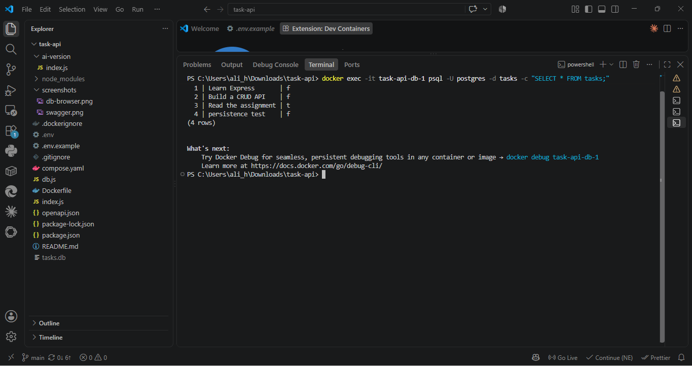
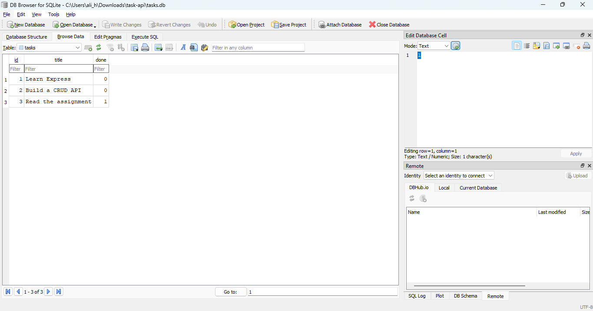
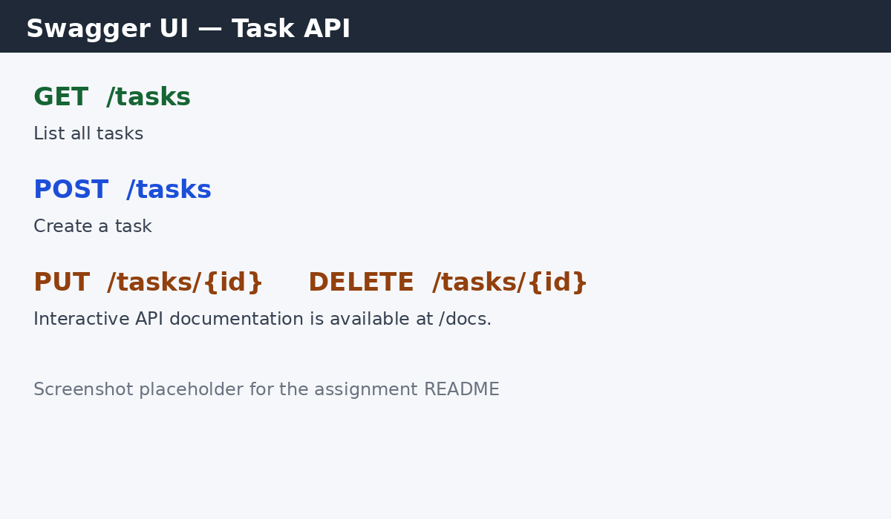

# Task API

A beginner-friendly CRUD API built for the FlyRank Backend Internship. It started as an in-memory list of tasks (Week 2), moved to a SQLite file (Week 3, A2), and now runs against a containerized PostgreSQL database (Week 1, A3) — with the exact same endpoints and responses at every stage. This is the same repository growing, not three separate projects.

## Running the whole stack (A3 — recommended)

One command starts both the API and its Postgres database:

```bash
cp .env.example .env
docker compose up
```

The API is then available at `http://localhost:3000`. The `tasks` table and its three seed rows are created automatically on first boot. To stop everything: `docker compose down` (add `-v` if you also want to wipe the volume and start clean).

Environment variables the app needs are documented in `.env.example` — copy it to `.env` and adjust if needed. Inside `compose.yaml`, the API reaches the database by its service name (`db`), not `localhost`.

### Example request

```bash
curl -i http://localhost:3000/tasks
```
```
HTTP/1.1 200 OK
Content-Type: application/json; charset=utf-8

[{"id":1,"title":"Learn Express","done":false},{"id":2,"title":"Build a CRUD API","done":false},{"id":3,"title":"Read the assignment","done":true}]
```

### Data in Postgres



*(Screenshot of `docker exec -it taskdb psql -U postgres -d tasks -c "SELECT * FROM tasks;"`, or the same query in a GUI like pgAdmin/DBeaver/TablePlus.)*

## Database (Week 1 A3 update — Postgres in Docker)

- **Start a real database server:**
  ```bash
  docker run --name taskdb -e POSTGRES_PASSWORD=dev -e POSTGRES_DB=tasks \
    -p 5432:5432 -v taskdata:/var/lib/postgresql/data -d postgres
  ```
  This runs the official `postgres` image, names the container `taskdb`, sets a password and a `tasks` database, maps port 5432 to the host, and mounts a named volume (`taskdata`) so the data survives even if the container is removed and recreated.
- **Look inside it:** `docker ps` to confirm it's running, then `docker exec -it taskdb psql -U postgres -d tasks` opens a `psql` prompt inside the container (`\dt` lists tables, `\q` quits).
- **Secrets:** the connection string lives in a git-ignored `.env` file. `.env.example` is committed with the same keys and placeholder values so anyone cloning the repo knows what to set. No password is ever hardcoded in the source.
- **One command for the whole stack:** `compose.yaml` defines two services — `api` (built from the `Dockerfile`) and `db` (the official `postgres` image with a named volume). `docker compose up` starts both together; the API waits for the database's healthcheck before starting.
- **Persistence proof:** created tasks, ran `docker compose down` then `docker compose up` again, and the tasks were still there — the named volume (`taskdata`) keeps Postgres's data outside the container's own lifecycle.

## Database (Week 3 update)

- **Why SQLite:** it's a single-file, zero-setup database — no server to install or run, perfect for a small CRUD API like this one, and an easy stepping stone toward Postgres/MySQL later.
- **Where the database lives:** `tasks.db` in the project root. It's created automatically the first time the server starts (see `db.js`), and it's git-ignored so every clone starts fresh.
- **How to start the project:** `npm install` then `npm start` (same as before) — the `tasks` table and the three seed tasks are created automatically if the file or table doesn't exist yet.


## Exploring the database by hand (Stage 4)

Opened `tasks.db` in DB Browser for SQLite and ran a few queries directly against it — the same file the API reads and writes.

Example query:

```sql
SELECT * FROM tasks WHERE done = 1;
```

This returned the seeded "Read the assignment" task. Hitting `GET /tasks?done=true` through the running API returned the exact same row, with no server restart needed — confirming the API and DB Browser are reading the same live file, not separate copies of the data.

## Requirements

* [Docker Desktop](https://www.docker.com/products/docker-desktop/) (or Podman) — recommended, runs the whole stack
* Node.js 18+ and npm — only needed if running the app outside Docker

## Installation & Run

**With Docker (recommended, one command):**
```bash
cp .env.example .env
docker compose up
```

**Without Docker** (Postgres already running locally on port 5432):
```bash
npm install
cp .env.example .env   # edit DATABASE_URL if your local Postgres differs
npm start
```

The API runs at `http://localhost:3000` either way.

## Endpoints

|Method|Endpoint|Description|Success|Errors|
|-|-|-|-|-|
|GET|`/`|API information|200|—|
|GET|`/health`|Health check (also pings the database)|200|503|
|GET|`/tasks`|List all tasks|200|—|
|GET|`/tasks/:id`|Get one task|200|404|
|POST|`/tasks`|Create a task|201|400|
|PUT|`/tasks/:id`|Update a task title and/or completion status|200|400, 404|
|DELETE|`/tasks/:id`|Delete a task|204|404|
|GET|`/stats`|Return total, done, and open counts|200|—|
|POST|`/reset`|Restore the three sample tasks|200|—|
|GET|`/docs`|Interactive Swagger UI documentation|200|—|

## Optional query parameters

* `GET /tasks?done=true` returns only completed tasks. Use `done=false` for open tasks.
* `GET /tasks?search=milk` searches task titles case-insensitively.
* `GET /tasks?limit=2\&offset=2` returns a page of matching tasks.
* Filtering, search, and pagination can be combined.

## Example curl requests

List tasks:

```bash
curl -i http://localhost:3000/tasks
```

Create a task:

```bash
curl -i -X POST http://localhost:3000/tasks \\
  -H "Content-Type: application/json" \\
  -d '{"title":"Buy milk"}'
```

Example response:

```text
HTTP/1.1 201 Created
Content-Type: application/json; charset=utf-8

{"id":4,"title":"Buy milk","done":false}
```

Filter, search, and paginate:

```bash
curl -i "http://localhost:3000/tasks?done=false\&search=express\&limit=2\&offset=0"
```

Get statistics and reset the in-memory data:

```bash
curl -i http://localhost:3000/stats
curl -i -X POST http://localhost:3000/reset
```

Update a task:

```bash
curl -i -X PUT http://localhost:3000/tasks/4 \\
  -H "Content-Type: application/json" \\
  -d '{"done":true}'
```

Delete a task:

```bash
curl -i -X DELETE http://localhost:3000/tasks/4
```

## Swagger UI

Open [http://localhost:3000/docs](http://localhost:3000/docs) while the server is running. Use **Try it out** to complete the full CRUD cycle and try the optional endpoints without curl.

The OpenAPI document is generated from the route comments with `swagger-jsdoc` when the server starts and is served through `swagger-ui-express`. The generated document is also saved as `openapi.json`.



## Mortality experiment (database edition, optional)

Try it yourself: run Postgres without a volume (`docker run -e POSTGRES_PASSWORD=dev -e POSTGRES_DB=tasks -p 5432:5432 -d postgres`, no `-v` flag), create a few tasks, then `docker rm -f` that container and start a fresh one — the tasks will be gone. A container's own filesystem dies with the container; a named volume is what keeps the database's files on disk independently of any one container's lifecycle, which is why `compose.yaml` mounts `taskdata:/var/lib/postgresql/data` for the `db` service instead.

## AI vs me

### Prompt used

> Build a beginner-friendly JavaScript Node.js API using Express.js only. Use port 3001 and an in-memory array with three sample tasks containing numeric id, string title, and boolean done fields. Implement GET /, GET /health, GET /tasks, GET /tasks/:id, POST /tasks, PUT /tasks/:id, and DELETE /tasks/:id. POST must require a non-empty title, assign the next id, set done to false, and return 201. PUT must allow title and/or done updates, reject an empty or invalid body with 400, and return 404 for an unknown id. DELETE must return 204 with no body and 404 for an unknown id. Return JSON errors and keep the code beginner-friendly with no database, authentication, TypeScript, ORM, or unnecessary folders. Also include Swagger UI at /docs using swagger-ui-express and document the API with an OpenAPI file.

### Three concrete differences found

1. The AI version combines the POST title validation messages, while the hand-built version distinguishes “Title is required” from “Title cannot be empty.”
2. The AI version uses a separate port, 3001, so it can be run beside the hand-built API for comparison.
3. The hand-built version includes the optional filtering, search, statistics, reset, pagination, and Swagger-jsdoc features; the quarantined AI version contains only the core Stage 0–6 CRUD API.

The AI version was run on port 3001 and tested with the Stage 4 CRUD requests. The hand-built version remained untouched while the AI version was reviewed.

### Rematch result

The second prompt added the exact validation-message distinction and the requirement to keep the optional query and statistics endpoints. The hand-built version already satisfies those additional requirements, so no change was made to the hand-built code after the review.

## Folder structure

```text
task-api/
├── package.json
├── package-lock.json
├── index.js
├── openapi.json
├── README.md
├── ai-version/
│   └── index.js
└── screenshots/
    └── swagger.png
```

## Validation and status codes

* New tasks require a non-empty `title`; invalid input returns `400`.
* Updates must include `title` and/or `done`; empty or invalid input returns `400`.
* Unknown task ids return `404` with a JSON error.
* Successful reads and updates return `200`.
* Successful creation returns `201`.
* Successful deletion returns `204` with no response body.

